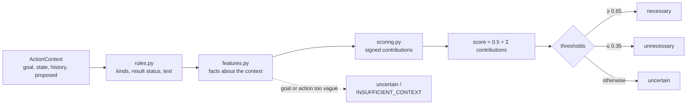

# Architecture and evaluation methodology

This document describes how the v0 gate decides, why it is built that way,
and how it was evaluated. For usage, see the [README](../README.md).

## Design goals

1. **Keep task success first.** Wrongly blocking a necessary action
   (`false unnecessary`) is the costliest error. Ambiguity resolves to
   `uncertain`, never to `unnecessary`.
2. **Interpretable.** Every decision is a sum of named contributions, and each
   contribution carries a reason code.
3. **Zero cost.** The gate is standard library only: no network, no models,
   no keys, no telemetry.
4. **Stable public API.** `evaluate_action(context) -> ActionDecision`, plus
   `Evaluator(EvaluatorConfig)` for configuration.

## Pipeline

| Module | Responsibility |
|---|---|
| `models.py` | Immutable dataclasses and enums; validates untrusted input at the boundary (`ContextValidationError`). |
| `similarity.py` | `SimilarityProvider` protocol and `LexicalSimilarity`: exact normalized-argument matching, with token and `SequenceMatcher` text similarity. |
| `lexicon.py` | Hand-curated vocabulary: stopwords, change verbs, concept groups, kind keywords. This is the main limitation of v0. |
| `rules.py` | Pure functions: action kind, mutation, result status (with content-aware mode for file reads), truncation, leads, state-change and knowledge-gap phrases. |
| `features.py` | Turns a whole context into `Features`: facts, not judgements. |
| `scoring.py` | Weights, contributions, aggregation, reason selection, confidence, public signals. |
| `evaluator.py` | Wires it together; blends an optional adapter; abstains on weak context. |
| `cli.py` | `suffiss-necessity evaluate / benchmark / simulate`. |

## Key features

- **Duplicate match.** The most recent history entry with the same tool and
  equal normalized arguments.
  - Paths are compared exactly: `src/a.py` and `src/b.py` are never near
    duplicates.
  - Only case and whitespace are treated as cosmetic. Word order and
    punctuation (for example SQL operators) are kept.
  - Volatile keys such as `timeout` and `request_id` are ignored.
- **Changed since match.** A successful mutation *after* the match that could
  affect the proposed target, or a non-negated change phrase in
  `current_state`.
  - A failed mutation is not a change.
  - Unknown targets are assumed to change (safe default).
  - Documentation files (including `LICENSE`, `README`, …) never invalidate
    test runs.
- **Verification candidate.** Observing the target of the agent's own change,
  or running tests after a code change, before it was verified.
- **Prerequisite.** A non-mutating read of something a change-intent goal
  refers to, before it was read or changed.
- **Information need.** A sentence in `current_state` says something related
  is not known yet ("logs have not been inspected").
- **Continuation and lead-following.** Paging through output that says it was
  truncated, or acting on a file or URL an earlier result surfaced. These
  apply to novel actions only, so they never override duplicate detection.
- **Goal completion.** One of:
  - explicit markers ("task complete")
  - a finish action in the history
  - a single-clause goal ("run unit tests", "fix X") matched by one
    successful action that covers it
- **Scope.** A broad action (index, crawl, "entire repository") is weighed
  against how broad the goal is.
- **Relevance.** Token overlap against the whole goal or its best clause,
  plus concept-group overlap.

## Contributions and weights

Every contribution is `weight × strength` with its reason code. Weights are
round numbers chosen from the design rationale. They were not fitted to the
benchmark.

| Contribution | Weight | Reason code | Fires when |
|---|---|---|---|
| goal relevance | +0.15 × relevance | `DIRECT_GOAL_DEPENDENCY` | relevance ≥ 0.3 |
| novelty | +0.10 | `NEW_INFORMATION_REQUIRED` (reads) / `DIRECT_GOAL_DEPENDENCY` (writes) | no match and relevance ≥ 0.3 |
| information need | +0.25 | `NEW_INFORMATION_REQUIRED` | a related knowledge gap in the state |
| continuation | +0.25 | `NEW_INFORMATION_REQUIRED` | paging truncated output |
| lead follow-up | +0.25 | `NEW_INFORMATION_REQUIRED` (reads) / `DIRECT_GOAL_DEPENDENCY` (writes) | target surfaced by an earlier result |
| prerequisite | +0.30 | `PREREQUISITE_ACTION` | see above |
| state change | +0.35 | `STATE_CHANGED`, or `VERIFICATION_REQUIRED` when observing the changed target | match exists and something relevant changed |
| verification | +0.30 | `VERIFICATION_REQUIRED` | verification candidate with no earlier match |
| polling | +0.20 | `NEW_INFORMATION_REQUIRED` | previous identical result was pending |
| finish | +0.30 | `DIRECT_GOAL_DEPENDENCY` | finish action and completion ≥ 0.5 |
| duplicate | −0.50 × similarity (× 0.5 for path-only writes) | `DUPLICATE_ACTION` / `REDUNDANT_VERIFICATION` | unchanged successful match |
| deterministic retry | −0.50 | `UNCHANGED_RETRY` | unchanged failed match |
| transient retry | −0.15 per attempt (max 3) | `UNCHANGED_RETRY` | unchanged timeout, 429 or 5xx |
| completion | −0.40 × completion | `GOAL_ALREADY_COMPLETED` | goal done; verification and post-change actions exempt |
| scope | −0.40 (narrow goal) / −0.15 (neutral goal) | `SCOPE_TOO_BROAD` | broad action, goal not broad |
| unrelated | −0.35 | `LOW_GOAL_RELEVANCE` | goal and action concepts disjoint |
| weak relevance | −0.10 | `LOW_GOAL_RELEVANCE` | relevance < 0.1 |

Relevance penalties are skipped for verification, continuation and lead
follow-up, which inherit relevance from the earlier step.

**Design rules behind the weights:**

- A lone exact duplicate (−0.50) is enough to block an action.
- A relevant change (+0.35) must outweigh most of a duplicate penalty.
- Most other single penalties only reach `uncertain`. Blocking needs either a
  strong signal or corroborating ones.

## Decision, reason and confidence

- **Score.** `clamp(0.5 + Σ contributions, 0, 1)`. Defaults: `necessary` at
  0.65 or above, `unnecessary` at 0.35 or below. Both are configurable through
  `Thresholds`.
- **Reason.** The reason code with the largest total contribution pointing the
  same way as the decision. For `uncertain` it is the largest in absolute
  value, and ties favour the penalty because it explains why the action was
  not cleared.
- **Confidence.** For `necessary` and `unnecessary` it is 0.5 plus how far the
  score lies past its threshold, scaled to 1.0. For `uncertain` it peaks at the
  middle of the band.
- **Abstention.** If the goal or the action has no informative words, the
  decision is always `uncertain / INSUFFICIENT_CONTEXT`, whatever the score.

## Extension points

- **`SimilarityProvider`.** `text_similarity` and `action_similarity`. Swap in
  embeddings without touching the rules.
- **`NecessityAdapter`.** `assess(context) -> AdapterAssessment | None`. The
  evaluator blends `(1 − w) · rule_score + w · necessity`. Returning `None`
  abstains. No adapter ships with v0.

Planned future work, not implemented: a local transformer classifier, a
fine-tuned small model, embedding similarity, teacher-model data generation,
and thin wrappers for agent frameworks.

## Evaluation methodology

The question is whether a lightweight gate can reduce redundant agent actions
without materially reducing task success.

### Datasets

| Set | Size | Purpose | Rule |
|---|---|---|---|
| `benchmarks/dataset.jsonl` | 30 cases, 6 categories | development | Labels committed before the first evaluator run |
| `benchmarks/holdout.jsonl` | 12 cases, 6 categories | out-of-sample estimate | Labels committed first; run once; never tuned on |
| `simulations/trajectories.jsonl` | 6 trajectories, 39 steps | end-to-end savings vs. success | Essential flags committed before the first run |

Hard cases were included on purpose:

- duplicate-looking actions that are necessary
- verification with and without changes
- broad searches for broad goals
- transient versus deterministic failures
- reworded searches whose answer is already known
- ambiguous state

### Metrics

- **`false_unnecessary_rate`** (primary safety metric): truly necessary
  actions predicted `unnecessary`, divided by all truly necessary actions.
- **`unnecessary_action_detection_rate`**: recall on truly unnecessary
  actions.
- **`potential_action_reduction_rate`**: share of all actions the gate would
  skip.
- **`uncertain_rate`**, accuracy, per-class precision, recall and F1, and the
  confusion matrix.
- **Simulation**: actions before and after, actions saved, avoidable actions
  removed, and whether every essential step still ran.

### Process

- **Append-only logs.** Results logs are never edited, so regressions and
  overfitting stay visible. `simulations/RESULTS.md` records a regression this
  process caught: a reason-code fix made an essential edit skippable under the
  skip-uncertain policy.
- **General fixes only.** Benchmark-driven changes had to be general: each
  shipped with unit tests on *new* scenarios, not the benchmark cases.
- **Some misses stay.** Failures without a clean general fix were left as
  documented misses rather than patched with case-specific rules.

### What the current evidence does and does not show

- **Promising.** With the recommended policy, simulated trajectories lost
  about 31% of their actions and none of their essential steps. No necessary
  benchmark action was blocked.
- **Not shown.**
  - With 17 truly necessary cases in total, zero observed false blocks still
    leaves a 95% upper bound of about 18% (rule of three). The < 3% target
    needs hundreds of labelled necessary actions.
  - All cases were written by the same author as the rules. Independent
    labelling, and traces from real agents, are the next needed steps.
